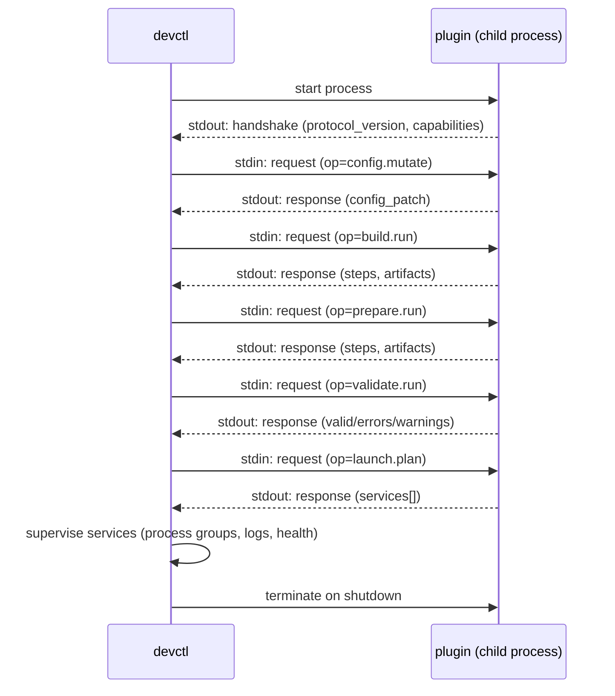
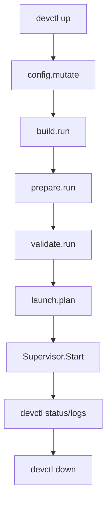

# devctl Plugin Authoring Guide (NDJSON Stdio Protocol v1)

devctl plugins let you turn “how we run dev in this repo” into a versioned, testable contract. A plugin is an executable that speaks a tiny NDJSON protocol over stdin/stdout, so devctl can ask it to mutate config, validate prerequisites, build/prepare artifacts, and produce a launch plan that devctl supervises.

This guide is a playbook: it explains the protocol, provides reference examples, and shows an end-to-end workflow for building a plugin developers can rely on day-to-day.

## 1. What a devctl plugin is

A devctl plugin is a long-lived child process managed by devctl. devctl starts the process, reads a required handshake from the plugin’s stdout, then drives the dev environment by sending request frames on stdin and reading response/event frames from stdout.

At a high level:

- devctl owns orchestration: ordering, timeouts, strictness, process supervision, state, and log capture.
- your plugin owns repo-specific logic: config derivation, prerequisite checks, build/prepare steps, and the service plan.
- the protocol boundary is small on purpose: JSON in, JSON out.

## 2. Quick start: your first plugin in 10 minutes

The quickest path to a useful plugin is to implement `config.mutate` and `launch.plan` for one service, then add `validate.run` so failures are actionable. This section gives you a copy/paste workflow that you can run in any repo with a bash shell and Python installed.

### Step 1: Create a plugin file

Create `plugins/myrepo-plugin.py`:

```python
#!/usr/bin/env python3
import json
import sys

def emit(obj):
    sys.stdout.write(json.dumps(obj) + "\n")
    sys.stdout.flush()

emit({
    "type": "handshake",
    "protocol_version": "v1",
    "plugin_name": "myrepo",
    "capabilities": {"ops": ["config.mutate", "validate.run", "launch.plan"]},
})

for line in sys.stdin:
    line = line.strip()
    if not line:
        continue
    req = json.loads(line)
    rid = req.get("request_id", "")
    op = req.get("op", "")

    if op == "config.mutate":
        emit({
            "type": "response",
            "request_id": rid,
            "ok": True,
            "output": {"config_patch": {"set": {"services.app.port": 8080}, "unset": []}},
        })
    elif op == "validate.run":
        emit({
            "type": "response",
            "request_id": rid,
            "ok": True,
            "output": {"valid": True, "errors": [], "warnings": []},
        })
    elif op == "launch.plan":
        emit({
            "type": "response",
            "request_id": rid,
            "ok": True,
            "output": {"services": [{"name": "app", "command": ["bash", "-lc", "python3 -m http.server 8080"]}]},
        })
    else:
        emit({
            "type": "response",
            "request_id": rid,
            "ok": False,
            "error": {"code": "E_UNSUPPORTED", "message": f"unsupported op: {op}"},
        })
```

Make it executable:

```bash
chmod +x plugins/myrepo-plugin.py
```

### Step 2: Add a `.devctl.yaml`

At the repo root:

```yaml
plugins:
  - id: myrepo
    path: python3
    args:
      - ./plugins/myrepo-plugin.py
    priority: 10
```

### Step 3: Verify handshake and run the pipeline

```bash
devctl plugins list
devctl plan
devctl up
devctl status
devctl logs --service app --follow
devctl down
```

If `plugins list` works, your handshake is valid and your stdout is clean. If `up` works, your `launch.plan` is valid and the supervisor can run the service.

## 3. The non-negotiable rules

The protocol is strict so devctl can be reliable and debuggable.

- stdout is protocol-only NDJSON:
  - one JSON object per line
  - no extra whitespace or banners
  - no progress messages
- stderr is for humans:
  - print logs, progress, and debug information to stderr
  - devctl captures stderr and prefixes it with the plugin id
- the first stdout frame must be a handshake.

If you print anything non-JSON to stdout, devctl treats it as protocol contamination and fails the plugin.

## 4. Lifecycle and pipeline (diagrams)

The plugin lifecycle is a simple handshake + request loop, but it sits inside devctl’s larger pipeline.



This flowchart is the “mental model” most plugin work should preserve: you add capabilities by filling in boxes, not by creating new bespoke orchestration.



## 5. Protocol frames: handshake, request, response, event

devctl’s protocol types are defined in Go and mirrored by JSON frames. The plugin does not need a library; it just needs to produce valid JSON objects with the right keys.

### 5.1. Handshake (stdout, first frame)

The handshake tells devctl who you are and which operations you support.

```json
{
  "type": "handshake",
  "protocol_version": "v1",
  "plugin_name": "example",
  "capabilities": {
    "ops": ["config.mutate", "validate.run", "build.run", "prepare.run", "launch.plan"],
    "streams": ["logs.follow"],
    "commands": ["db-reset"]
  },
  "declares": {
    "side_effects": "process",
    "idempotent": false
  }
}
```

**Fields:**

- `type`: must be `"handshake"`.
- `protocol_version`: currently `"v1"`.
- `plugin_name`: human-readable name.
- `capabilities`:
  - `ops`: list of supported request operations (`request.op`).
  - `streams`: optional, for stream-producing ops (see events).
  - `commands`: optional, for dynamic CLI commands (see `commands.list`).
- `declares`: optional metadata (devctl currently treats this as informational; use it anyway for clarity).

### 5.2. Request (stdin)

devctl sends request frames on stdin.

```json
{
  "type": "request",
  "request_id": "plugin-1",
  "op": "config.mutate",
  "ctx": {
    "repo_root": "/abs/path/to/repo",
    "cwd": "",
    "deadline_ms": 30000,
    "dry_run": false
  },
  "input": {
    "config": {}
  }
}
```

**Fields:**

- `request_id`: unique per call; echo it back in the response.
- `op`: operation name, e.g. `config.mutate`.
- `ctx`:
  - `repo_root`: repo root chosen by the user (`--repo-root`).
  - `deadline_ms`: remaining time budget for this operation (best-effort).
  - `dry_run`: whether devctl intends side effects to be skipped.
- `input`: op-specific JSON object; treat it as untrusted input and validate types.

### 5.3. Response (stdout)

For each request, emit exactly one response on stdout.

```json
{
  "type": "response",
  "request_id": "plugin-1",
  "ok": true,
  "output": {}
}
```

If you can’t handle the request, return `ok=false` with an error.

```json
{
  "type": "response",
  "request_id": "plugin-1",
  "ok": false,
  "error": { "code": "E_UNSUPPORTED", "message": "unsupported op" }
}
```

### 5.4. Event (stdout, streaming)

Some ops return a `stream_id` in their response output and then emit `event` frames.

```json
{ "type": "event", "stream_id": "s1", "event": "log", "level": "info", "message": "hello" }
{ "type": "event", "stream_id": "s1", "event": "end", "ok": true }
```

Streams are for “follow” style operations where devctl should keep reading until you emit `event=end` (or the plugin is terminated).

## 6. Implementing common operations

Most real plugins implement some subset of the pipeline ops. devctl merges outputs across plugins in priority order and (optionally) enforces strictness rules on collisions.

### 6.1. `config.mutate`: return a config patch

`config.mutate` lets the plugin turn repo knowledge into config values. You return a `config_patch` with `set` and `unset`. Keys use dotted paths so you can build nested config incrementally.

```json
{
  "type": "response",
  "request_id": "x",
  "ok": true,
  "output": {
    "config_patch": {
      "set": {
        "env.VITE_BACKEND_URL": "http://localhost:8082",
        "services.backend.port": 8083
      },
      "unset": ["env.SOME_OLD_KEY"]
    }
  }
}
```

**Best practices:**

- treat `input.config` as the current config and compute a patch from it.
- avoid “random” values (like ephemeral ports) unless you also patch the chosen value into config.
- make the patch idempotent: repeated application should converge.

### 6.2. `validate.run`: report pass/fail with actionable errors

Validation should answer: “can we proceed?” and “if not, what should the developer do next?”

```json
{
  "type": "response",
  "request_id": "x",
  "ok": true,
  "output": {
    "valid": false,
    "errors": [
      { "code": "E_MISSING_TOOL", "message": "missing tools: pnpm, docker" }
    ],
    "warnings": []
  }
}
```

**Best practices:**

- keep errors stable and searchable (consistent codes/messages).
- prefer one error per missing prerequisite; aggregate if that’s friendlier.

### 6.3. `build.run` / `prepare.run`: steps and artifacts

These ops are for deterministic side-effect steps (compilation, generating files, installing deps). devctl can pass a list of requested step names; your plugin should run only the requested steps if provided.

```json
{
  "type": "response",
  "request_id": "x",
  "ok": true,
  "output": {
    "steps": [
      { "name": "backend", "ok": true, "duration_ms": 1234 }
    ],
    "artifacts": {
      "backend-bin": "backend/dist/server"
    }
  }
}
```

**Dry-run behavior:**

- if `ctx.dry_run` is true, do not perform side effects.
- still report which commands you would have run (to stderr) and return `ok=true` if the plan is valid.

### 6.4. `launch.plan`: describe services devctl should supervise

The launch plan is what devctl turns into processes, logs, health checks, and `devctl status/logs/down`.

```json
{
  "type": "response",
  "request_id": "x",
  "ok": true,
  "output": {
    "services": [
      {
        "name": "backend",
        "cwd": "backend",
        "command": ["make", "run"],
        "env": { "PORT": "8083" },
        "health": { "type": "http", "url": "http://127.0.0.1:8083/health", "timeout_ms": 30000 }
      }
    ]
  }
}
```

**Service fields:**

- `name`: required; used as the stable identifier for logs/status.
- `cwd`: optional; resolved relative to `repo_root` if not absolute.
- `command`: required; argv array (no shell parsing unless you explicitly run a shell).
- `env`: optional; merged with the parent environment.
- `health`: optional; `type` is `"tcp"` or `"http"`; use `timeout_ms` for readiness.

### 6.5. `commands.list` / `command.run`: plugin-defined CLI commands

Plugins can expose custom commands (e.g., `devctl db-reset`) without adding Go code to devctl. devctl asks for the command list and wires cobra subcommands dynamically.

`commands.list` response (shape is a convention in this repo; keep it stable within your plugin suite):

```json
{
  "type": "response",
  "request_id": "x",
  "ok": true,
  "output": {
    "commands": [
      { "name": "db-reset", "help": "Reset local DB" }
    ]
  }
}
```

`command.run` request:

```json
{
  "type": "request",
  "request_id": "x",
  "op": "command.run",
  "ctx": { "repo_root": "/abs/repo", "deadline_ms": 30000, "dry_run": false },
  "input": { "name": "db-reset", "argv": ["--force"], "config": { "services": {} } }
}
```

Your response should include an exit code:

```json
{ "type": "response", "request_id": "x", "ok": true, "output": { "exit_code": 0 } }
```

## 7. Merge behavior, ordering, and strictness

If you configure multiple plugins, devctl calls them in deterministic order and merges their outputs. This is how you can have a “stack” of plugins (shared org defaults + repo specifics) without baking everything into one monolithic script.

- Ordering:
  - primary key: `priority` (lower first)
  - tie-break: plugin `id` (stable)
- Config merge:
  - each `config_patch` is applied in order
  - invalid dotted paths and type mismatches are treated as errors
- Step merge (`build.run`, `prepare.run`):
  - steps are merged by `name`
  - collisions are either errors (strict) or “last wins” (non-strict)
- Service merge (`launch.plan`):
  - services are merged by `name`
  - collisions are either errors (strict) or “last wins” (non-strict)

This is why stable names matter:

- good: `myrepo.backend`, `myrepo.web`, `db.reset`
- risky: `backend`, `web` (fine in a single-plugin repo, collision-prone in stacks)

## 8. A minimal Python plugin you can copy/paste

This skeleton is a good starting point for repo-local plugins. It is intentionally small and strict about stdout.

```python
#!/usr/bin/env python3
import json
import sys
import time

def emit(obj):
    sys.stdout.write(json.dumps(obj) + "\n")
    sys.stdout.flush()

def log(msg):
    sys.stderr.write(msg + "\n")
    sys.stderr.flush()

emit({
    "type": "handshake",
    "protocol_version": "v1",
    "plugin_name": "example",
    "capabilities": {"ops": ["config.mutate", "validate.run", "launch.plan"]},
})

for line in sys.stdin:
    line = line.strip()
    if not line:
        continue
    req = json.loads(line)
    rid = req.get("request_id", "")
    op = req.get("op", "")
    ctx = req.get("ctx", {}) or {}
    inp = req.get("input", {}) or {}

    dry_run = bool(ctx.get("dry_run", False))
    repo_root = ctx.get("repo_root", "")

    if op == "config.mutate":
        emit({"type": "response", "request_id": rid, "ok": True,
              "output": {"config_patch": {"set": {"env.EXAMPLE": "1"}, "unset": []}}})
    elif op == "validate.run":
        emit({"type": "response", "request_id": rid, "ok": True,
              "output": {"valid": True, "errors": [], "warnings": []}})
    elif op == "launch.plan":
        emit({"type": "response", "request_id": rid, "ok": True,
              "output": {"services": [{"name": "sleep", "command": ["bash","-lc","sleep 10"]}]}})
    else:
        emit({"type": "response", "request_id": rid, "ok": False,
              "error": {"code": "E_UNSUPPORTED", "message": f"unsupported op: {op}"}})
```

## 9. Wiring your plugin into a repo (`.devctl.yaml`)

devctl discovers plugins from a config file at the repo root (by default `.devctl.yaml`).

```yaml
plugins:
  - id: myrepo
    path: python3
    args:
      - ./plugins/myrepo-plugin.py
    env:
      MYREPO_FEATURE_FLAG: "1"
    priority: 10
```

Then run:

```bash
devctl plugins list
devctl plan
devctl up
devctl status
devctl logs --service <name> --follow
devctl down
```

## 10. Timeouts, cancellation, and dry-run

Plugins operate in messy environments, so you need to design for “this is taking too long” and “this should not do anything destructive”. devctl provides `ctx.deadline_ms` and `ctx.dry_run`, but your plugin still needs to enforce timeouts and safe behavior explicitly.

- `ctx.deadline_ms` is a hint:
  - wrap external commands with your own timeouts
  - for shell invocations, `timeout <dur> <cmd>` is often good enough
- devctl may terminate your process group:
  - treat SIGTERM as expected
  - keep state idempotent so reruns are safe
- `ctx.dry_run` should mean “no side effects”:
  - skip `docker compose up`, `pnpm install`, DB resets, etc.
  - it is fine to compute plans and print intended actions to stderr

## 11. Debugging and test strategy

Good plugins are boring: they behave deterministically and fail loudly with actionable messages.

- Make failures obvious:
  - write a single-line stderr log before running each external command
  - on error, include the command and exit code in stderr
- Reproduce quickly:
  - keep a small “fixture plugin” that simulates failures (timeouts, bad health, validation fail)
  - keep smoke tests that run a full `up/status/logs/down` loop in a temp repo

In this repo, the fixture patterns live under `devctl/testdata/plugins/` and smoke tests are runnable via `go run ./cmd/devctl smoketest-*`.

## 12. Troubleshooting: the common failure modes

Most plugin failures are protocol failures. This section is a checklist for the issues that tend to bite in real use.

- Protocol contamination:
  - symptom: devctl fails with a protocol/stdout error
  - cause: your plugin printed non-JSON to stdout
  - fix: move prints to stderr; ensure stdout emits only `json.dumps(obj)` + newline
- Missing handshake:
  - symptom: start fails with handshake timeout
  - cause: the first stdout frame was not a valid handshake
  - fix: emit handshake immediately and flush
- Op timeout:
  - symptom: `context deadline exceeded`
  - cause: plugin got stuck (hung process, waiting on network, deadlock)
  - fix: add per-command timeouts and log the exact command you ran
- Health timeout:
  - symptom: `tcp health timeout` or `http health timeout`
  - cause: service never bound, bound the wrong address, or HTTP never returns 2xx–4xx
  - fix: validate ports/URLs when producing `launch.plan` and log the readiness target

## 13. Reference: schema cheatsheet

This section summarizes what devctl expects at the JSON boundary.

- `handshake.capabilities.ops`: list of operations you implement
- `request`:
  - `request.op`: one of your supported ops
  - `request.ctx.dry_run`: skip side effects when true
  - `request.ctx.deadline_ms`: time budget hint; enforce your own timeouts
- `response`:
  - `ok=true`: parse `output` according to the op
  - `ok=false`: provide `error.code` and `error.message`
- `event`:
  - emit for stream operations until you send `event=end`
