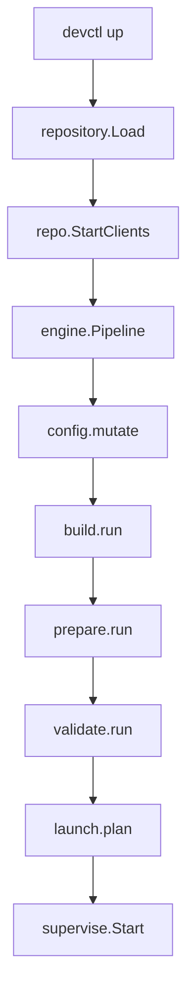
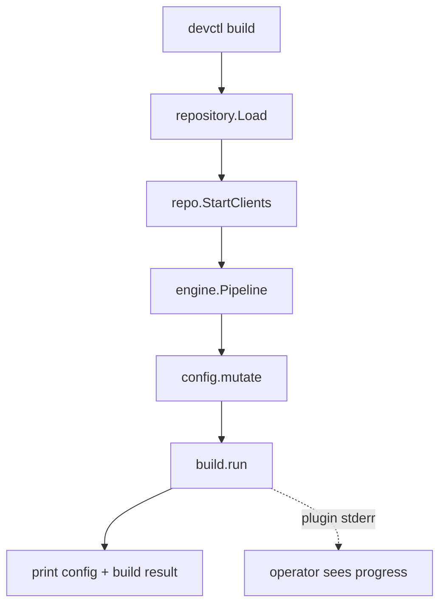
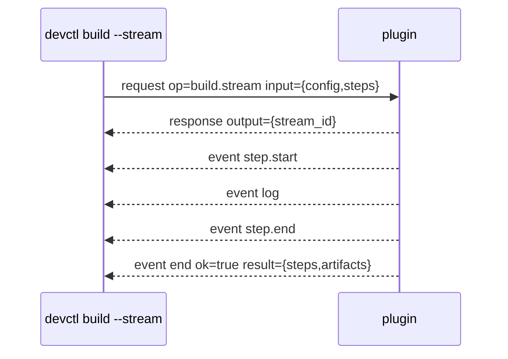

# Design: devctl phase verbs for streaming long-running steps

## Executive summary

This ticket should add first-class devctl verbs for running individual pipeline phases without having to run the whole `devctl up` pipeline. The immediate operator need is to run the Pinocchio web-chat `build.run` phase in `/home/manuel/workspaces/2026-05-13/coinvault-loop-analysis/pinocchio` because it can take long enough to hit the default per-operation timeout, and because the operator wants to watch progress while the build happens.

The recommended user-facing API is:

```bash
# Run all build.run providers after config.mutate, print progress, print final JSON summary.
devctl build --repo-root /home/manuel/workspaces/2026-05-13/coinvault-loop-analysis/pinocchio --timeout 10m

# Run only selected build step names, matching the existing up --build-step contract.
devctl build --step build-backend --step frontend-assets --timeout 10m

# Symmetric phase verbs.
devctl prepare --step pnpm-install --timeout 10m
devctl validate --timeout 1m
devctl launch-plan --timeout 30s    # or keep existing devctl plan as the canonical launch-plan verb

# Explicit generic escape hatch for future phases.
devctl phase run build --step build-backend --timeout 10m
```

The lowest-risk implementation is to extract the repeated “load repo, start plugins, create engine.Pipeline, run `config.mutate` first” setup from `up.go` and `plan.go` into a shared helper, then add static Cobra commands registered in `cmd/devctl/cmds/root.go`. The phase commands should reuse the existing engine methods first (`Pipeline.Build`, `Pipeline.Prepare`, `Pipeline.Validate`, `Pipeline.LaunchPlan`) and print the same result structs already returned by plugins. A second, optional implementation phase can add structured live progress. The current runtime already reads plugin stderr concurrently and routes it through zerolog, so progress can be visible immediately if plugins write progress to stderr and users run devctl with an appropriate log level. True stdout streaming for phase progress requires a protocol extension because `build.run` currently returns one final response, not an event stream.

## Problem statement and scope

### What the user needs

The user wants a way to run one devctl phase directly, especially the build phase, without asking `devctl up` to continue into prepare, validate, launch planning, and supervision. They also want logs to stream while that build is running.

The concrete repo is Pinocchio:

```text
/home/manuel/workspaces/2026-05-13/coinvault-loop-analysis/pinocchio
```

Its `.devctl.yaml` selects the `web-chat` profile and configures a `pinocchio-webchat` plugin at `./cmd/web-chat/plugins/webchat.py` (`.devctl.yaml:1-27`). That plugin declares `build.run`, `prepare.run`, `validate.run`, `launch.plan`, and dynamic `command.run` capabilities (`webchat.py:102-123`). The plugin’s `build.run` currently shells out to `go build` with a hard-coded `timeout=120` and captures subprocess output instead of streaming it (`webchat.py:220-268`). It also exposes dynamic commands named `build-frontend` and `build-backend` through `command.run` (`webchat.py:405-460`), but those are plugin-specific and do not solve the general devctl phase problem.

### In scope

- Add a stable `devctl build` command that runs `config.mutate` and then `build.run`.
- Add symmetric commands for other side-effect or inspection phases where useful: `devctl prepare`, `devctl validate`, and possibly `devctl launch-plan` as an alias or clearer sibling to `devctl plan`.
- Preserve existing plugin protocol v2 request/response shapes for the initial implementation.
- Preserve existing `--repo-root`, `--config`, `--profile`, `--strict`, `--dry-run`, and `--timeout` behavior through `AddRepoFlags`.
- Preserve `--build-step`/`--prepare-step` semantics, but rename on phase commands to simply `--step` for a better user experience.
- Provide a clear path to live progress streaming without contaminating stdout protocol frames.

### Out of scope for the first implementation

- Rewriting plugin phase semantics around long-lived streams.
- Supervising build subprocesses directly from devctl instead of through plugins.
- Changing the Pinocchio plugin itself, except as a follow-up that can improve its stderr progress and remove its internal 120-second timeout.
- Adding persistence of build artifacts to `.devctl/state.json`.

## Current-state architecture

### CLI registration and command families

The devctl binary creates a Cobra root command in `cmd/devctl/main.go`. It adds logging, the help system, static commands, dynamic plugin commands, and then executes the root command (`cmd/devctl/main.go:16-34`). Static commands are registered in `cmd/devctl/cmds/root.go`; today that list includes `plan`, `plugins`, `profiles`, `up`, `down`, `status`, `logs`, `stream`, `tui`, service lifecycle helpers, and the internal wrapper command (`root.go:8-24`). There is no static `build`, `prepare`, or `validate` verb in that registry.

Dynamic plugin commands are a separate mechanism. `AddDynamicPluginCommands` inspects configured plugins, reads `handshake.capabilities.commands`, and wires commands that invoke `command.run` (`dynamic_commands.go:22-83`). Those commands are useful for repo-specific verbs like Pinocchio’s `build-backend`, but they are not the same as core pipeline phase verbs because they only target one plugin-defined command and do not run the cross-plugin `Pipeline.Build` merge semantics.

### Repo flags and runtime context

Most repo-aware commands use `AddRepoFlags`, which adds a shared “Repository” flag section via Glazed schema fields. The relevant fields are `--repo-root`, `--config`, `--profile`, `--strict`, `--dry-run`, and `--timeout` (`common.go:45-127`). `getRootOptions` decodes those flags for Cobra commands and normalizes paths and durations (`common.go:157-184`). These flags are the right substrate for phase verbs because they already encode the operator’s needed escape hatch: `--timeout 10m`.

Repository loading happens in `pkg/repository`. `repository.Load` resolves the repo root, default config path, optional override path, active profile, profile-filtered plugin specs, and request metadata (`repository.go:34-100`). `Repository.StartClients` starts all selected plugin processes with the runtime factory (`repository.go:143-153`). The phase verbs should use the same path so profile selection and `.devctl.override.yaml` behavior remain identical to `up` and `plan`.

### Pipeline phases and merge semantics

The engine package already models the phase API. `Pipeline` contains a list of runtime clients and strict/dry-run options (`pipeline.go:13-22`). It provides these methods:

- `MutateConfig(ctx, cfg)` calls `config.mutate` in plugin order and applies each returned config patch (`pipeline.go:24-45`).
- `Build(ctx, cfg, steps)` calls `build.run` on supporting plugins, passes `{config, steps}`, merges artifacts, and merges step results by name (`pipeline.go:102-135`).
- `Prepare(ctx, cfg, steps)` mirrors build for `prepare.run` (`pipeline.go:137-170`).
- `Validate(ctx, cfg)` calls `validate.run`, merges errors and warnings, and marks the combined result invalid if any plugin returns invalid (`pipeline.go:81-100`).
- `LaunchPlan(ctx, cfg)` calls `launch.plan`, merges services by name, and enforces strict collision rules if requested (`pipeline.go:47-79`).

The data structures returned by these methods are already JSON-ready. `StepResult`, `BuildResult`, and `PrepareResult` are defined in `pkg/engine/types.go:30-44`. The plugin authoring guide documents that build and prepare steps are named/selectable and return steps plus artifacts (`devctl-plugin-authoring.md:360-388`). It also documents step collision semantics (`devctl-plugin-authoring.md:509-519`).

### Existing `devctl up` phase ordering

`newUpCmd` is the only command that currently runs the full phase sequence. It loads repo config, starts all clients, constructs an `engine.Pipeline`, runs `config.mutate`, optionally runs `build.run`, optionally runs `prepare.run`, optionally runs `validate.run`, runs `launch.plan`, and either prints a dry-run JSON object or starts supervised services (`up.go:80-200`). It already has `--skip-build`, `--skip-prepare`, `--skip-validate`, `--build-step`, and `--prepare-step` flags (`up.go:205-211`).

The README describes the intended `devctl up` pipeline as:

```text
config.mutate → build.run → prepare.run → validate.run → launch.plan → supervise
```

and explains that build and prepare are named steps skipped with the existing flags (`README.md:302-324`, `README.md:388-398`). The new phase verbs should not invent new semantics; they should expose existing boxes in that pipeline.

### Existing `devctl plan`

`devctl plan` is already a partial phase verb. It runs `config.mutate` and `launch.plan`, then prints a JSON object containing `config` and `plan` (`plan.go:17-90`). It is useful evidence that a phase-oriented command can share the same repo loading, client startup, strictness, and timeout machinery without requiring `up`.

### Runtime request/response and event streams

The runtime client API has two invocation styles:

```go
type Client interface {
    Call(ctx context.Context, op string, input any, output any) error
    StartStream(ctx context.Context, op string, input any) (streamID string, events <-chan protocol.Event, err error)
}
```

This is defined in `runtime/client.go:19-25`. `Call` sends one request and waits for exactly one final response (`client.go:73-130`). `StartStream` sends a request that returns a `stream_id`, then subscribes to event frames for that stream (`client.go:133-198`). The protocol supports event frames with `stream_id`, `event`, `level`, `message`, `fields`, and optional `ok` (`protocol/types.go:69-77`). The router buffers event frames until a subscriber exists and closes stream channels on `event=end` (`router.go:117-181`).

However, `Pipeline.Build` currently uses `Client.Call`, not `Client.StartStream` (`pipeline.go:102-115`). Therefore, progress from `build.run` cannot currently arrive as protocol events unless the plugin implements a different stream-start op and devctl calls it with `devctl stream start --op ...`. This distinction is important: first-class `devctl build` can be added without protocol changes, but first-class phase progress as stdout event frames requires either new phase stream ops or a revised phase invocation contract.

### stderr logging behavior

The plugin authoring guide states a strict stdout/stderr rule: stdout is protocol-only NDJSON and stderr is for human logs, progress, and debug output (`devctl-plugin-authoring.md:139-152`). The runtime already reads stderr concurrently and logs each line with the plugin id (`client.go:261-274` in the full file). This means there is already a safe, low-friction progress path: plugins can write progress lines to stderr while handling `build.run`, and devctl can show them through its logging output. Pinocchio’s plugin already has a `log(msg)` function that writes to stderr (`webchat.py:18-20`), but its subprocess calls use `capture_output=True`, so tool output from `go build`, `pnpm install`, or `vite build` is not streamed live (`webchat.py:232-237`, `webchat.py:280-285`, `webchat.py:419-424`, `webchat.py:445-450`).

## Gap analysis

### Gap 1: no stable top-level build verb

There is no `newBuildCmd` in the static command registry (`root.go:8-24`). The operator can approximate some behavior with `devctl up --skip-prepare --skip-validate --dry-run` only if `up` is willing to run build before stopping, but that is conceptually backwards and still tied to full `up` behavior. The operator can also use Pinocchio’s dynamic `build-backend` command, but that bypasses `Pipeline.Build` and does not generalize to all plugins.

### Gap 2: timeout defaults are too short for expensive phases

The shared default timeout is `30s` (`common.go:109-118`). `up` wraps each phase call in `context.WithTimeout(ctx, opts.Timeout)` (`up.go:119-167`). That is correct for safety, but a top-level build command must make it obvious that operators can use `--timeout 10m`. Documentation and examples should highlight this.

### Gap 3: live logs are only partially available

Runtime stderr reading exists, but build subprocess output is frequently captured by plugins instead of inherited/streamed. Pinocchio’s `webchat.py` logs “building Go binary” before the call and “binary built” after it, but `go build` output is captured and only included on failure (`webchat.py:229-268`). For truly visible progress, plugin authors need guidance: write progress to stderr, avoid `capture_output=True` for long-running build subprocesses, or tee subprocess stdout/stderr to plugin stderr while keeping protocol stdout clean.

### Gap 4: protocol event streams are not connected to phase methods

The protocol can stream events, and `devctl stream start` can print those events (`stream.go:28-123`), but `build.run` is currently a plain call. If future plugins want structured event progress for `build.run`, devctl needs an explicit extension point such as `build.stream`, `phase.stream`, or optional event emission during `build.run` with a declared `stream_id`. That should be a second phase, not a prerequisite for `devctl build`.

## Proposed user-facing CLI

### Primary verbs

Add these static commands:

```text
devctl build       Run config.mutate + build.run and print BuildResult.
devctl prepare     Run config.mutate + prepare.run and print PrepareResult.
devctl validate    Run config.mutate + validate.run and print ValidateResult; exit nonzero if invalid.
devctl launch-plan Optional explicit alias for plan, or keep plan as canonical.
```

`devctl plan` should remain because it already exists and users know it. `devctl launch-plan` could be an alias or omitted to avoid churn. If added, it should call the same helper as `plan`.

### Flags

All phase verbs should include `AddRepoFlags(cmd)`, therefore supporting:

- `--repo-root`: where `.devctl.yaml` lives.
- `--config`: custom config path.
- `--profile`: active profile override.
- `--strict`: collision handling.
- `--dry-run`: ask plugins to avoid side effects.
- `--timeout`: per operation timeout.

Build and prepare should add:

```text
--step <name>   Named step to run; repeatable.
--json          Print compact JSON lines or machine-friendly JSON only. Optional if pretty JSON is always emitted.
```

Keep `devctl up --build-step` and `devctl up --prepare-step` unchanged for compatibility. Do not rename those flags as part of this ticket.

### Example operator flow for Pinocchio

```bash
cd /home/manuel/workspaces/2026-05-13/coinvault-loop-analysis/pinocchio

# Build only, with a longer timeout than the default 30s.
devctl build --timeout 10m

# If the plugin supports a named backend step and honors input.steps:
devctl build --step build-backend --timeout 10m

# Continue the normal lifecycle after build succeeds.
devctl up --skip-build --timeout 2m
```

The last command is useful because it lets the operator separate a slow build from the rest of environment startup.

## Proposed internal architecture

### Extract a phase command runner helper

The code in `up.go` and `plan.go` repeats the same setup:

1. Decode root options.
2. Build runtime request metadata.
3. Load repository.
4. Apply config strictness.
5. Start plugin clients.
6. Defer client close.
7. Construct `engine.Pipeline`.
8. Run `config.mutate` with timeout.
9. Run one or more downstream phases.

Create a small helper in a new file, for example `cmd/devctl/cmds/pipeline_runner.go`:

```go
type phaseRunner struct {
    opts    rootOptions
    repo    *repository.Repository
    clients []runtime.Client
    pipe    *engine.Pipeline
}

func withPhaseRunner(cmd *cobra.Command, fn func(context.Context, *phaseRunner, patch.Config) error) error {
    opts, err := getRootOptions(cmd)
    if err != nil { return err }

    meta, err := requestMetaFromRootOptions(opts)
    if err != nil { return err }

    repo, err := repository.Load(repository.Options{
        RepoRoot: opts.RepoRoot,
        ConfigPath: opts.Config,
        ProfileName: opts.Profile,
        Cwd: meta.Cwd,
        DryRun: opts.DryRun,
    })
    if err != nil { return err }

    if !opts.Strict && repo.Config.Strictness == "error" {
        opts.Strict = true
    }
    if len(repo.Specs) == 0 {
        return errors.New("no plugins configured (add .devctl.yaml)")
    }

    factory := runtime.NewFactory(runtime.FactoryOptions{
        HandshakeTimeout: 2 * time.Second,
        ShutdownTimeout:  3 * time.Second,
    })
    clients, err := repo.StartClients(cmd.Context(), factory)
    if err != nil { return err }
    defer closeClientsWithTimeout(clients, opts.Timeout)

    p := &engine.Pipeline{Clients: clients, Opts: engine.Options{Strict: opts.Strict, DryRun: opts.DryRun}}

    opCtx, cancel := context.WithTimeout(cmd.Context(), opts.Timeout)
    conf, err := p.MutateConfig(opCtx, patch.Config{})
    cancel()
    if err != nil { return err }

    return fn(cmd.Context(), &phaseRunner{opts: opts, repo: repo, clients: clients, pipe: p}, conf)
}
```

The helper should not know about output formatting. Each command remains responsible for phase-specific result handling.

### Add `newBuildCmd`

Pseudocode:

```go
func newBuildCmd() *cobra.Command {
    var steps []string
    cmd := &cobra.Command{
        Use:   "build",
        Short: "Run devctl build phase (config.mutate + build.run)",
        RunE: func(cmd *cobra.Command, args []string) error {
            return withPhaseRunner(cmd, func(ctx context.Context, r *phaseRunner, conf patch.Config) error {
                opCtx, cancel := context.WithTimeout(ctx, r.opts.Timeout)
                br, err := r.pipe.Build(opCtx, conf, steps)
                cancel()
                if err != nil { return err }

                out := map[string]any{"config": conf, "build": br}
                return printJSON(cmd.OutOrStdout(), out)
            })
        },
    }
    cmd.Flags().StringSliceVar(&steps, "step", nil, "Build step name (repeatable)")
    AddRepoFlags(cmd)
    return cmd
}
```

The output includes `config` because every phase command implicitly ran `config.mutate`, and `devctl plan` already includes both `config` and `plan` in its output (`plan.go:83-90`). This makes debugging easier: operators can see exactly what config the plugin used for the build.

### Add `newPrepareCmd`

Same as build, but calls `r.pipe.Prepare(opCtx, conf, steps)` and emits `{config, prepare}`.

### Add `newValidateCmd`

Pseudocode:

```go
func newValidateCmd() *cobra.Command {
    cmd := &cobra.Command{
        Use:   "validate",
        Short: "Run devctl validation phase (config.mutate + validate.run)",
        RunE: func(cmd *cobra.Command, args []string) error {
            return withPhaseRunner(cmd, func(ctx context.Context, r *phaseRunner, conf patch.Config) error {
                opCtx, cancel := context.WithTimeout(ctx, r.opts.Timeout)
                vr, err := r.pipe.Validate(opCtx, conf)
                cancel()
                if err != nil { return err }

                _ = printJSON(cmd.OutOrStdout(), map[string]any{"config": conf, "validate": vr})
                if !vr.Valid {
                    return errors.New("validation failed")
                }
                return nil
            })
        },
    }
    AddRepoFlags(cmd)
    return cmd
}
```

This mirrors `up` behavior, which prints the validation result and returns `validation failed` when the merged result is invalid (`up.go:150-162`).

### Register commands

Update `cmd/devctl/cmds/root.go`:

```go
root.AddCommand(newBuildCmd())
root.AddCommand(newPrepareCmd())
root.AddCommand(newValidateCmd())
```

Place them near `newPlanCmd()` because they are pipeline verbs, not service state verbs.

### Consider refactoring `plan` and `up`

After adding the helper, `plan` can be rewritten to call `withPhaseRunner` and then run `LaunchPlan`. `up` can either remain explicit for readability or share only a lower-level `loadRepoPipeline` helper. Do not over-refactor `up` in the first patch if it obscures the important state/supervisor logic.

A practical compromise:

- Extract `loadRepoPipeline(cmd, shutdownTimeout)` that returns `opts`, `repo`, `clients`, `pipeline`, and `cleanup`.
- Let each command decide whether and when to run `MutateConfig`.
- Rewrite `plan`, `build`, `prepare`, and `validate` first.
- Leave `up` unchanged until tests prove the helper is stable.

## Logging and streaming design

### Phase 1: visible progress through stderr and zerolog

The protocol guide already says progress belongs on stderr (`devctl-plugin-authoring.md:143-150`). The runtime already reads stderr while a `Call` is in progress. Therefore, the first implementation should document and test this path:

```bash
devctl build --timeout 10m --log-level info
```

If the logging flag name differs because it comes from Glazed logging setup, use the actual root help output. The important implementation point is: do not print human progress to plugin stdout. Plugin stdout must remain protocol frames only, or `readStdoutLoop` will fail all pending requests as protocol contamination (`client.go:233-260`).

For Pinocchio, a follow-up plugin patch should replace long `subprocess.run(..., capture_output=True)` calls with streaming helpers. Pseudocode:

```python
def run_streaming(argv, cwd, timeout_s):
    log("running: " + shell_join(argv))
    proc = subprocess.Popen(
        argv,
        cwd=cwd,
        stdout=subprocess.PIPE,
        stderr=subprocess.STDOUT,
        text=True,
        bufsize=1,
    )
    for line in proc.stdout:
        log(line.rstrip())
    code = proc.wait(timeout=timeout_s)
    return code
```

That keeps protocol stdout clean and uses the runtime’s existing stderr reader for live progress.

### Phase 2: optional structured progress events

If human stderr progress is not enough, add an optional protocol extension instead of changing `build.run` abruptly. Two compatible designs are plausible.

#### Option A: `build.stream` and `prepare.stream`

Plugins that support structured streaming add ops:

```json
{
  "capabilities": {
    "ops": ["config.mutate", "build.run", "build.stream"],
    "streams": ["build.stream"]
  }
}
```

`devctl build --stream` prefers `build.stream` if every selected build provider supports it, otherwise falls back to `build.run` with stderr logs. The stream start input mirrors build input:

```json
{
  "config": { "...": "..." },
  "steps": ["build-backend"]
}
```

The stream response returns:

```json
{ "stream_id": "build-pinocchio-1" }
```

Events look like:

```json
{ "type": "event", "stream_id": "build-pinocchio-1", "event": "step.start", "message": "build-backend" }
{ "type": "event", "stream_id": "build-pinocchio-1", "event": "log", "level": "info", "message": "go build ..." }
{ "type": "event", "stream_id": "build-pinocchio-1", "event": "step.end", "fields": {"name":"build-backend", "ok":true, "duration_ms": 1234} }
{ "type": "event", "stream_id": "build-pinocchio-1", "event": "end", "ok": true }
```

The problem with this option is result delivery: streams currently end with events, while `Pipeline.Build` expects a `BuildResult`. The plugin could include the final result in the `end.fields.result`, but devctl would need code to normalize that back to `BuildResult`.

#### Option B: keep `build.run`, allow side-channel events with declared request id

This is less invasive for plugin authors but more invasive for the protocol. A plugin could emit events during a normal `build.run` call using a convention such as `stream_id = request_id + ":events"`. The runtime already buffers events before subscription (`router.go:117-151`), but the caller would need a way to subscribe before the final response reveals a stream id. That suggests adding a new `Event.RequestID` field or a `Client.CallWithEvents` method. This is a larger protocol change and should not block the first phase.

### Recommendation

Ship `devctl build` first using existing `Pipeline.Build` and stderr progress. Add `build.stream` later only if users need machine-readable progress events in the TUI or CI. This keeps the first patch small, useful, and compatible with existing plugins.

## Implementation phases

### Phase 1: static phase verbs with existing request/response protocol

Files to edit:

- `cmd/devctl/cmds/root.go`: register new commands.
- `cmd/devctl/cmds/phase.go` or `cmd/devctl/cmds/build.go`: implement `newBuildCmd`, `newPrepareCmd`, `newValidateCmd`, helper functions.
- `cmd/devctl/cmds/plan.go`: optionally reuse helper after tests pass.
- `README.md`: add examples and command table entries.
- `pkg/doc/topics/devctl-user-guide.md`: document phase verbs and timeout examples.
- `pkg/doc/topics/devctl-plugin-authoring.md`: add guidance for stderr progress during long build/prepare steps.

Validation commands:

```bash
go test ./cmd/devctl/cmds ./pkg/engine ./pkg/runtime -count=1
go test ./... -count=1

go run ./cmd/devctl build --repo-root testdata/some-fixture --dry-run
```

If no fixture is appropriate, create a lightweight test plugin under `testdata/plugins/e2e` or a new phase-specific fixture.

### Phase 2: tests for command behavior

Add command tests that instantiate Cobra commands and run against fixture repositories. Existing command tests in `cmd/devctl/cmds/*_test.go` provide patterns. Test cases:

1. `devctl build --dry-run` runs `config.mutate` before `build.run` and prints `config` plus `build`.
2. `devctl build --step backend` passes `steps:["backend"]` to the plugin.
3. `devctl prepare --step pnpm-install` mirrors build behavior.
4. `devctl validate` exits nonzero for invalid merged validation and still prints the validation JSON.
5. `--timeout 1ns` returns a context deadline error for a slow plugin.
6. `--profile` filters plugins the same way `up` and `plan` do.

### Phase 3: plugin progress guidance and Pinocchio follow-up

The devctl core can only display progress that plugins emit. For Pinocchio specifically, update `/home/manuel/workspaces/2026-05-13/coinvault-loop-analysis/pinocchio/cmd/web-chat/plugins/webchat.py` in a separate work item:

- Make `build.run` honor `input.steps`; today it appends a `build-backend` step but does not inspect the requested `steps` array (`webchat.py:220-268`).
- Replace `capture_output=True` long subprocess calls with a streaming helper that writes tool output to stderr.
- Consider removing or parameterizing the plugin-local `timeout=120` so devctl’s `--timeout 10m` is not defeated by an internal two-minute timeout.
- Add a frontend build step to `build.run` if the desired operator command is `devctl build` rather than dynamic `devctl build-frontend`.

### Phase 4: structured event streaming if needed

If stderr progress is not enough:

- Define `build.stream` and `prepare.stream` in `pkg/doc/topics/devctl-plugin-authoring.md`.
- Add engine methods such as `BuildStream(ctx, cfg, steps, sink)`.
- Reuse runtime `StartStream` and router behavior.
- Decide final result encoding for streamed phases.
- Add TUI integration only after CLI behavior is stable.

## API reference for the intern

### Existing phase method contracts

```go
func (p *Pipeline) MutateConfig(ctx context.Context, cfg patch.Config) (patch.Config, error)
func (p *Pipeline) Build(ctx context.Context, cfg patch.Config, steps []string) (engine.BuildResult, error)
func (p *Pipeline) Prepare(ctx context.Context, cfg patch.Config, steps []string) (engine.PrepareResult, error)
func (p *Pipeline) Validate(ctx context.Context, cfg patch.Config) (engine.ValidateResult, error)
func (p *Pipeline) LaunchPlan(ctx context.Context, cfg patch.Config) (engine.LaunchPlan, error)
```

### Existing plugin JSON inputs

`build.run` and `prepare.run` receive:

```json
{
  "config": { "merged": "config after config.mutate" },
  "steps": ["optional", "selected", "step", "names"]
}
```

`validate.run` and `launch.plan` receive:

```json
{
  "config": { "merged": "config after config.mutate" }
}
```

### Existing result shapes

Build and prepare:

```json
{
  "steps": [
    { "name": "build-backend", "ok": true, "duration_ms": 1234 }
  ],
  "artifacts": {
    "binary": "cmd/web-chat/bin/web-chat"
  }
}
```

Validate:

```json
{
  "valid": false,
  "errors": [{ "code": "E_MISSING", "message": "node_modules missing" }],
  "warnings": []
}
```

Launch plan:

```json
{
  "services": [
    { "name": "api", "command": ["go", "run", "./cmd/api"] }
  ]
}
```

## Diagrams

### Current `up` flow



### Proposed phase verb flow



### Later structured streaming flow



## Risks and tradeoffs

### Risk: users expect `devctl build` to stream tool output automatically

Devctl can only stream what plugins emit. The first implementation should be honest: it provides a direct phase verb and displays plugin stderr; plugin authors must avoid capturing long subprocess output if they want detailed progress.

### Risk: `--step` names are only advisory if plugins ignore them

`Pipeline.Build` already passes the selected step names to plugins (`pipeline.go:113`). It cannot force a plugin to honor them. Documentation should say that plugin authors must filter their own steps based on `input.steps`.

### Risk: internal plugin timeouts can still fire

Pinocchio’s plugin currently has internal `timeout=120` values. `devctl build --timeout 10m` will extend the devctl request deadline but will not override plugin-local subprocess timeouts. The Pinocchio follow-up should parameterize or remove those internal limits.

### Risk: over-refactoring `up` can introduce lifecycle regressions

`up` includes state checks, restart prompts, supervisor startup, and state persistence. Keep the first patch focused on new phase verbs and shared setup. Refactor `up` only when tests cover the full lifecycle.

## Alternatives considered

### Use only dynamic plugin commands

Rejected as insufficient. Dynamic commands already exist, and Pinocchio exposes `build-backend` and `build-frontend`. But dynamic commands are repo-specific, do not merge across plugins, do not expose standard `build.run` artifacts/steps, and do not make `devctl build` a predictable core verb.

### Teach `up` more skip flags

Rejected as awkward. `up --skip-prepare --skip-validate --dry-run` still reads like “start the environment” and carries state/supervisor concerns. A direct phase verb is clearer and safer.

### Implement streaming protocol first

Rejected for the first patch. The runtime already has stream support, but phase methods use request/response calls. A streaming phase protocol needs careful result encoding and compatibility work. The operator’s immediate need is mostly met by direct phase verbs plus longer timeout plus stderr progress.

## Open questions

1. Should `devctl validate` be a top-level command even if some users expect validation to be part of `up` only? Recommendation: yes, because it is symmetrical and useful in CI.
2. Should `devctl launch-plan` exist, or should `devctl plan` remain the only name? Recommendation: keep `plan`; optionally add `launch-plan` as an alias later.
3. Should build/prepare phase commands default to pretty JSON, terse human summaries, or both? Recommendation: pretty JSON by default because `plan` already emits JSON; add human summaries later if needed.
4. Should `devctl build` include `config` in output? Recommendation: yes, to mirror `plan` and help debug config-derived build behavior.
5. How should structured streaming phases return final artifacts? Recommendation: postpone until there is a concrete TUI/CI need.

## References

- `/home/manuel/workspaces/2026-05-14/devctl-build/devctl/cmd/devctl/main.go:16-34` — root command initialization and dynamic command wiring.
- `/home/manuel/workspaces/2026-05-14/devctl-build/devctl/cmd/devctl/cmds/root.go:8-24` — static command registry; missing build/prepare/validate verbs.
- `/home/manuel/workspaces/2026-05-14/devctl-build/devctl/cmd/devctl/cmds/common.go:45-184` — shared repo flags and root option decoding.
- `/home/manuel/workspaces/2026-05-14/devctl-build/devctl/cmd/devctl/cmds/up.go:80-211` — full pipeline sequence and existing skip/step flags.
- `/home/manuel/workspaces/2026-05-14/devctl-build/devctl/cmd/devctl/cmds/plan.go:17-90` — existing partial phase command.
- `/home/manuel/workspaces/2026-05-14/devctl-build/devctl/pkg/engine/pipeline.go:24-183` — engine phase methods and merge ordering.
- `/home/manuel/workspaces/2026-05-14/devctl-build/devctl/pkg/engine/types.go:30-44` — build/prepare result structs.
- `/home/manuel/workspaces/2026-05-14/devctl-build/devctl/pkg/runtime/client.go:19-25` — runtime client API.
- `/home/manuel/workspaces/2026-05-14/devctl-build/devctl/pkg/runtime/client.go:73-198` — request/response and stream invocation paths.
- `/home/manuel/workspaces/2026-05-14/devctl-build/devctl/pkg/protocol/types.go:19-77` — protocol capabilities, requests, responses, and events.
- `/home/manuel/workspaces/2026-05-14/devctl-build/devctl/pkg/doc/topics/devctl-plugin-authoring.md:139-235` — stdout/stderr rules and phase lifecycle.
- `/home/manuel/workspaces/2026-05-14/devctl-build/devctl/pkg/doc/topics/devctl-plugin-authoring.md:360-394` — build/prepare result contract.
- `/home/manuel/workspaces/2026-05-13/coinvault-loop-analysis/pinocchio/.devctl.yaml:1-27` — concrete target repo plugin config.
- `/home/manuel/workspaces/2026-05-13/coinvault-loop-analysis/pinocchio/cmd/web-chat/plugins/webchat.py:102-123` — Pinocchio plugin capabilities and dynamic build commands.
- `/home/manuel/workspaces/2026-05-13/coinvault-loop-analysis/pinocchio/cmd/web-chat/plugins/webchat.py:220-268` — Pinocchio `build.run` implementation and current internal timeout/captured output behavior.
